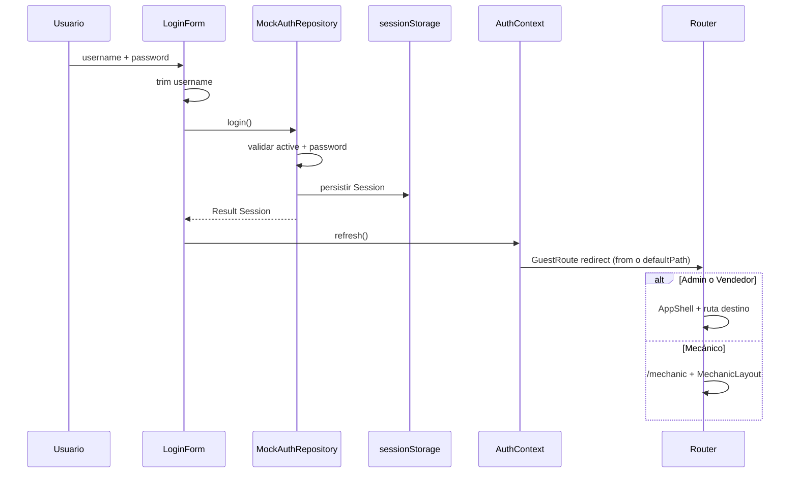

# Milestone 2 — WM2: Autenticación, shell y navegación por rol

| Campo | Valor |
|---|---|
| **ID plan** | WM2 |
| **Estado** | Completado |
| **Fecha** | 2026-08-27 |
| **Referencia** | [`docs/plans_web/plan-001.md`](../plans_web/plan-001.md) § WM2 |
| **Alcance** | Login, sesión mock, shell desktop/mecánico, guards UX, policies en mutaciones |
| **Siguiente** | WM3 — Dashboard operativo |

---

## 1. Objetivo

Entregar autenticación realista por formulario, shell de navegación según rol, guards de ruta y validación de permisos en servicios mock — base para todas las pantallas de negocio WM3–WM12.

---

## 2. Contexto previo

WM1 dejó:

- Design system, contratos, seed y repositorios esqueleto
- `MockAuthRepository` sin implementar
- `AppLayout` placeholder sin nav por rol
- Router con solo `FoundationPage`

WM2 reemplaza el flujo de verificación WM1 por login + shell operativo.

---

## 3. Decisiones clave

### 3.1 Sesión mock separada de `AppState` + persistencia en `sessionStorage`

**Decisión:** `mocks/session.ts` guarda `Session` en memoria y en `sessionStorage` (`solocamiones.mock.session`). Se hidrata al cargar el módulo para que un reload conserve la sesión y la URL actual. `resetMockState()` y `resetDemoData()` limpian sesión.

**Por qué:** La sesión no es dato de negocio del seed. La persistencia en tab permite recargar en `/customers` sin volver al login. El swap futuro a cookie/JWT (API M10) reemplazará este mecanismo mock.

### 3.2 `AuthProvider` + `AuthRepository`

**Decisión:** React Context expone `user` (sin password), `login`, `logout`. La UI nunca llama `seed.ts` ni muta estado directamente.

**Por qué:** Mismo patrón mock→API que WM1. `api/client/auth-api.ts` documenta el futuro `POST /api/auth/login`.

### 3.3 Guards UX en capas + `requirePermission` en servicios

**Decisión:**

| Capa | Componente | Comportamiento |
|---|---|---|
| Auth + rol de layout | `ProtectedRoute` | Sin sesión → `/login` (guarda `from` para volver). Rol incorrecto para el shell → `UnauthorizedPage` standalone |
| Permiso por ruta | `RouteAccessGuard` | Ruta conocida sin permiso → `UnauthorizedPage` dentro del shell. Ruta desconocida → `Outlet` → 404 |
| Rutas no registradas | `CatchAllRoute` | Sin sesión → login. Con sesión → 404 standalone |
| Mutaciones mock | `require-permission.ts` | Valida `can()` antes de mutar (ej. `MockUserRepository.save`) |

**Por qué:** El plan endurece el Make: ocultar menú ≠ seguridad. Los guards mejoran UX; los servicios son la fuente de verdad. Separar **401 (sin permiso)** de **404 (ruta inexistente)** evita confundir `/profitability` con `/profitability/profitability`.

### 3.4 Credenciales visibles, sin auto-login

**Decisión:** `DemoCredentialsPanel` compacto bajo el formulario; referencia desde `shared/config/demo-credentials.ts`. El usuario escribe manualmente. `LoginForm` hace `trim()` del usuario y ofrece toggle Ver/Ocultar contraseña.

**Por qué:** Alineado con decisión cerrada #5 del plan — referencia visible, no botones “Entrar” por tarjeta.

### 3.5 Shell dual: desktop vs mecánico

**Decisión:** Admin/Vendedor → `AppShell` (sidebar 9/4 ítems). Mecánico → `MechanicLayout` (~430px, bottom nav).

**Por qué:** Roles con superficies distintas; el mecánico no debe ver el shell comercial.

### 3.6 Sidebar activo solo en rutas válidas

**Decisión:** `RoleNav` usa `isNavItemActive()` — no el prefijo por defecto de `NavLink`. Rutas 404 no resaltan ningún ítem del menú.

**Por qué:** Evita marcar “Rentabilidad” activa en `/profitability/profitability` u otras URLs inválidas que comparten prefijo.

---

## 4. Estructura añadida / modificada

```
apps/web/src/
├── api/client/auth-api.ts          # Stub HTTP login (M10)
├── features/
│   ├── auth/
│   │   ├── AuthContext.tsx
│   │   ├── LoginPage.tsx
│   │   ├── LoginForm.tsx
│   │   ├── DemoCredentialsPanel.tsx
│   │   └── UnauthorizedPage.tsx
│   ├── mechanic/
│   │   ├── MechanicLayout.tsx
│   │   └── MechanicPlaceholderPage.tsx
│   └── placeholder/
│       ├── PlaceholderPage.tsx
│       └── NotFoundPage.tsx
├── mocks/
│   ├── session.ts                  # memoria + sessionStorage
│   ├── demo-controls.ts            # reset + 12 escenarios (estructura WM12)
│   └── services/require-permission.ts
└── shared/
    ├── config/demo-credentials.ts
    └── layout/
        ├── AppShell.tsx
        ├── RoleNav.tsx
        ├── UserMenu.tsx
        ├── DemoControls.tsx
        ├── ProtectedRoute.tsx
        ├── RouteAccessGuard.tsx
        ├── CatchAllRoute.tsx
        ├── GuestRoute.tsx
        ├── PageHeader.tsx
        └── navigation.ts             # nav items, isKnownDesktopRoute, isNavItemActive
```

**Modificados:** `MockAuthRepository`, `MockUserRepository`, `state.ts`, `router.tsx`, `App.tsx`, `AppLayout.tsx` (deprecated).

---

## 5. Flujo de autenticación



---

## 6. Criterios de aceptación

| Criterio | Estado |
|---|---|
| Credenciales seed visibles y funcionan al escribirlas manualmente | ✅ |
| Credenciales incorrectas → error, sin sesión | ✅ |
| Admin: 9 secciones; Vendedor: 4; Mecánico: app separada | ✅ |
| Usuario inactivo no entra (`user.active === false`) | ✅ |
| Vendedor en `/users` o `/profitability` → `UnauthorizedPage` en shell (sin nombre de sección) | ✅ |
| Ruta inexistente (ej. `/profitability/profitability`) → 404, sidebar sin ítem activo | ✅ |
| Recarga conserva sesión y permanece en la misma URL | ✅ |
| Servicios mock rechazan mutaciones sin permiso | ✅ (`MockUserRepository`) |
| Interfaz lista para `POST /api/auth/login` futuro | ✅ (`auth-api.ts` + `AuthRepository`) |

---

## 7. Verificación

```bash
cd apps/web
npm run dev
npm run typecheck
npm run build
```

**Flujos manuales:**

1. Abrir `/` → redirige a `/login`
2. Login `admin` / `demo1234` → `/dashboard`, sidebar con 9 ítems
3. Logout → `/login`
4. Login `laura` / `demo1234` → 4 ítems; ir a `/profitability` → página “Acceso no autorizado” (permanece en shell)
5. En `/customers`, recargar → sigue en Clientes con sesión activa
6. Ir a `/profitability/profitability` → 404; ningún ítem del sidebar resaltado
7. Login `carlos` / `demo1234` → `/mechanic/pending`, bottom nav
8. Credenciales incorrectas o `admin ` (espacio) → error o login correcto tras trim
9. En DEV: “Reiniciar datos demo” → sesión cerrada, vuelve a login

---

## 8. Fuera de alcance (WM2)

| Tema | Milestone |
|---|---|
| Dashboard KPIs reales | WM3 |
| Pantallas de negocio (inventario, ventas, …) | WM3–WM12 |
| Persistencia del estado mock de negocio (facturas, inventario, …) | WM12 / API |
| Runner completo de 12 escenarios demo | WM12 |
| `HttpAuthRepository` funcional | WM12 / API M10 |
| Tests automatizados de auth | Recomendados; sin runner en `apps/web` aún |

---

## 9. Handoff a WM3

Listo para implementar:

1. **`features/dashboard/`** — consumir repositorios existentes dentro de `AppShell`
2. **`KpiCard`, `RecentInvoicesList`, `ActivityTimeline`** — según plan WM3
3. **Agregaciones** sobre `items`, `invoices`, `workOrders`, `events` en servicios mock

La ruta `/dashboard` ya existe como placeholder; reemplazar el elemento en `router.tsx`.

---

## 10. Referencias

- [`docs/plans_web/plan-001.md`](../plans_web/plan-001.md) § WM2
- [`docs/done_web/milestone-1.md`](./milestone-1.md)
- [`docs/ROLES_AND_PERMISSIONS.md`](../ROLES_AND_PERMISSIONS.md)
