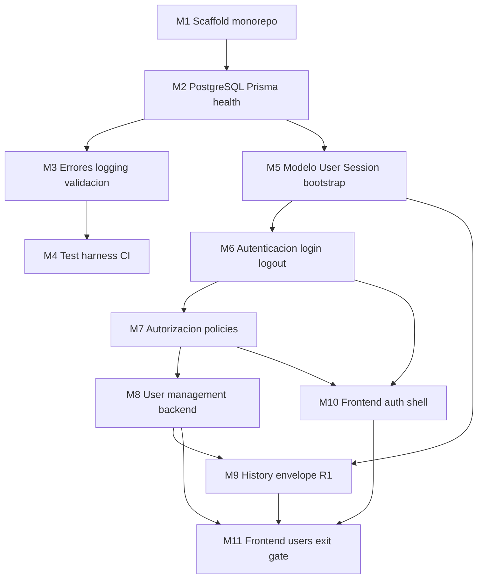

# Plan 001 — Release 1 Milestones: Foundation + Access and Users

**Release:** 1 — Application Foundation and Access (Local Development)  
**Estado:** Milestone 2 completado — Milestone 3 pendiente  
**Último milestone:** Milestone 11 — Frontend usuarios + exit gate Release 1

---

## Contexto

- **Release activo:** Release 1 — Application Foundation and Access (Local Development) ([`../DEVELOPMENT_PLAN.md`](../DEVELOPMENT_PLAN.md) §Release 1).
- **Release 0:** COMPLETADO y aprobado.
- **Entorno:** desarrollo y pruebas **únicamente en local** durante Release 1. No hay staging ni producción.
- **Primer despliegue productivo:** después de completar Release 2 — Billing Core ([`../DEVELOPMENT_PLAN.md`](../DEVELOPMENT_PLAN.md) §First production deployment).
- **Features en alcance:** [`../FEATURES/01_ACCESS_AND_USERS.md`](../FEATURES/01_ACCESS_AND_USERS.md) + slice R1 de [`../FEATURES/14_HISTORY_ADMIN_AND_RECOVERY.md`](../FEATURES/14_HISTORY_ADMIN_AND_RECOVERY.md).
- **Estado del repo al crear el plan:** solo documentación; sin código productivo.
- **Ciclo por milestone:** plan → implementación → pruebas → revisión → commit.


## Alcance total de Release 1

| Incluido | Excluido |
|---|---|
| Scaffold FE/BE, Prisma, PostgreSQL local, validación, errores, tests, CI local | Facturas, clientes, inventario, Work Orders, fotos, CxC, CxP |
| Login por `username`, sesiones, roles, gestión de usuarios, autorización server-side | Dashboard KPIs del prototipo, recovery/diagnostics completos (Release 8) |
| History envelope + eventos de ciclo de vida de usuarios | Otros tipos de evento de negocio (Release 2+) |
| Bootstrap CLI del primer Administrator | Staging, producción, hosting, RPO/RTO, HTTPS productivo, backups gestionados, rollback productivo |
| Verificación en browser de flujos UI | Object storage (Release 4+) |

## Decisiones cerradas (fuente de verdad)

Documentadas en [`../FEATURES/01_ACCESS_AND_USERS.md`](../FEATURES/01_ACCESS_AND_USERS.md), [`../DEVELOPMENT_PLAN.md`](../DEVELOPMENT_PLAN.md), [`../FEATURES/14_HISTORY_ADMIN_AND_RECOVERY.md`](../FEATURES/14_HISTORY_ADMIN_AND_RECOVERY.md) y [`../INFRASTRUCTURE_PLAN.md`](../INFRASTRUCTURE_PLAN.md):

1. Login identity: `username` único.
2. Primer Administrator: comando CLI one-shot; rechaza si ya existen usuarios; sin credenciales hardcodeadas de producción.
3. Perfil MVP: `name`, `username`, `phone?`, `email?`, `role`, `active`, `passwordHash`, `createdAt`, `updatedAt`.
4. Contraseña MVP: mínimo 6 caracteres; sin reglas extra de complejidad.
5. Release 0 completado; Release 1 activo.
6. Hosting / RPO / RTO: pendientes; requeridos solo antes del primer despliegue productivo (post Release 2); **no bloquean Milestones 1–11**.
7. CI smoke R1: migraciones, `/health/live`, `/health/ready`, login, sesión, autorización.
8. Mechanic en R1: proyección mínima de sesión + tests negativos; proyección WO completa en release correspondiente.
9. History R1: envelope reutilizable + solo eventos de ciclo de vida de usuarios.
10. Feature 01: un feature de producto; módulos `access` y `users` compartiendo modelo/repositorio de usuario.

## Diagrama de dependencias



## Milestones — estado

| ID | Milestone | Estado |
|---|---|---|
| M1 | Scaffold monorepo FE/BE + convenciones + health stub | completado |
| M2 | PostgreSQL + Prisma + health readiness | completado |
| M3 | Errores, logging, validación HTTP | pendiente |
| M4 | Test harness + CI baseline (smoke R1) | pendiente |
| M5 | Modelo User/Session + bootstrap CLI admin | pendiente |
| M6 | Login/logout/sesiones (AUTH-001) | pendiente |
| M7 | Autorización server-side (AUTH-002/005) | pendiente |
| M8 | User management backend (AUTH-003/004) | pendiente |
| M9 | History envelope R1 + eventos de usuarios | pendiente |
| M10 | Frontend login/logout/shell por rol | pendiente |
| M11 | Frontend gestión de usuarios + exit gate Release 1 | pendiente |

---

## Milestone 1 — Scaffold monorepo y convenciones

**Objetivo:** Crear la estructura mínima ejecutable del monolito modular (frontend + backend) con TypeScript, scripts de desarrollo y convención feature-based.

**Alcance:**
- `apps/web/` — React + Vite + TypeScript
- `apps/api/` — Node.js + Express + TypeScript
- ESLint + Prettier + `tsconfig` estricto
- Scripts: `dev`, `build`, `lint`, `typecheck`
- `.gitignore`, `.env.example` (nombres, sin secretos)
- README mínimo de arranque local

**Principales cambios esperados:**
- `package.json` raíz (npm workspaces recomendado)
- Express app vacía + Vite app placeholder
- Convención `feature/{routes,controller,service,repository,validation,types}` con stub `health`

**Dependencias / decisiones:**
- Same-origin en despliegue futuro; en local: proxy Vite → API o puertos coordinados

**Pruebas:**
- `npm run typecheck` y `npm run build` pasan
- Smoke manual: health stub responde

**Definición de terminado:**
- Clonar, instalar, ejecutar FE+BE en local, ver health check.
- Sin lógica de negocio ni BD.

---

## Milestone 2 — PostgreSQL, Prisma y conectividad

**Objetivo:** Persistencia PostgreSQL local con Prisma, migraciones y health readiness.

**Alcance:**
- Cliente Prisma singleton + cierre graceful
- Migración inicial
- `GET /health/live` y `GET /health/ready`
- PostgreSQL local nativo o contenedor

**Principales cambios esperados:**
- `apps/api/src/infrastructure/database/`
- `DATABASE_URL` en `.env.example`
- Scripts `db:migrate`, `db:generate`

**Pruebas:**
- Integration: readiness falla sin BD, pasa con BD
- Migración aplicable en BD limpia

**Definición de terminado:**
- API reporta readiness real contra PostgreSQL local.
- Migraciones reproducibles desde cero.

---

## Milestone 3 — Errores, logging, validación HTTP

**Objetivo:** Infraestructura transversal: errores, middleware, logs estructurados, validación runtime.

**Alcance:**
- Taxonomía de errores de aplicación
- Correlation/request ID, error mapper, secure headers básicos
- Logger estructurado (Pino recomendado)
- Convención Zod en `validation/` por feature
- Respuestas con `errorId` seguro al cliente

**Pruebas:**
- Unit: mapeo error → status HTTP
- Integration: 400 consistente; 500 genérico + errorId

**Definición de terminado:**
- Pipeline estándar request → validate → controller → service operativo.
- Logs correlacionables por request ID.

---

## Milestone 4 — Test harness y CI baseline

**Objetivo:** Unit + integration contra PostgreSQL real; CI sin despliegue.

**Alcance:**
- Vitest (o Jest) + Supertest
- BD de test separada (`DATABASE_URL_TEST`)
- GitHub Actions: install → lint → typecheck → unit → integration → build
- **Smoke R1 en CI:** migraciones, `/health/live`, `/health/ready`, login, sesión, autorización (cuando existan en milestones posteriores; plantilla lista desde M4, completada en M6–M7)

**Pruebas:**
- CI verde
- Integration test health/ready como plantilla

**Definición de terminado:**
- CI bloquea merge si falla typecheck o tests.
- Smoke scope R1 documentado y automatizable.

---

## Milestone 5 — Modelo User + Session + bootstrap CLI

**Objetivo:** Modelar usuarios, roles, sesiones y bootstrap del primer Administrator.

**Alcance:**
- Campos MVP confirmados: `name`, `username` (unique), `phone?`, `email?`, `role`, `active`, `passwordHash`, `createdAt`, `updatedAt`
- Enum rol: `ADMINISTRATOR`, `SELLER`, `MECHANIC`
- Tabla `Session`: token opaco, `userId`, `expiresAt`
- Repositorios en módulos `access` y `users` (compartiendo modelo User)
- **CLI bootstrap one-shot:** crea primer Administrator solo si no existen usuarios; rechaza si ya hay usuarios; sin credenciales hardcodeadas de producción
- Validación contraseña: mínimo 6 caracteres

**Dependencias / decisiones:**
- Argon2id vs. bcrypt — decidir en plan del milestone (recomendación: Argon2id)

**Pruebas:**
- Unique constraint en `username`
- Usuario inactive no borrado físicamente
- Bootstrap exitoso en BD vacía; rechazo si ya hay usuarios

**Definición de terminado:**
- Migración User + Session con FKs e índices.
- Bootstrap CLI documentado y testeado.
- Repositorios testeados sin HTTP de auth aún.

---

## Milestone 6 — Autenticación: login, logout, sesiones (AUTH-001)

**Objetivo:** Login por `username` + password; sesiones same-origin con cookie HttpOnly.

**Alcance:**
- `POST /api/auth/login` — verificación credenciales, sesión nueva, rotación
- `POST /api/auth/logout`
- `GET /api/auth/session`
- Cookie: `HttpOnly`, `SameSite` explícito; `Secure` solo en despliegue HTTPS futuro
- Sesiones en PostgreSQL
- Rate limiting + mensaje genérico en login fallido
- Rechazar login si cuenta inactive
- Middleware `requireAuth` + recheck active user

**Dependencias / decisiones:**
- CSRF para mutaciones — decidir en plan del milestone

**Pruebas:**
- Login válido → cookie + session OK
- Credenciales inválidas / inactive → rechazo
- Logout invalida sesión
- Sin password/hash en responses ni logs

**Definición de terminado:**
- AUTH-001 cubierto por tests automatizados vía API.

---

## Milestone 7 — Autorización server-side (AUTH-002, AUTH-005)

**Objetivo:** Enforcement de roles en servidor; base para matriz de [`../ROLES_AND_PERMISSIONS.md`](../ROLES_AND_PERMISSIONS.md).

**Alcance:**
- Helpers/policies: `requireRole(...)`, `requireAdministrator`
- Proyección mínima por rol en `/api/auth/session`:
  - Mechanic: solo datos mínimos de sesión (`id`, `username`, `name`, `role`) — **sin datos comerciales**
  - Seller/Administrator: proyección de perfil acorde al rol
- Rutas protegidas placeholder para tests negativos
- Documentar que proyección WO completa queda para release de Work Orders

**Pruebas:**
- Seller/Mechanic → 403 en ruta admin-only
- Administrator → 200
- Request sin sesión → 401

**Definición de terminado:**
- Tests negativos de rol vía Supertest.
- Mechanic verificado solo con proyección mínima + denegaciones.

---

## Milestone 8 — Gestión de usuarios Administrator (backend, AUTH-003/004)

**Objetivo:** CRUD operacional de cuentas en módulo `users`; deactivación sin borrado físico.

**Alcance:**
- `POST /api/admin/users` — crear (`name`, `username`, password, role, optional phone/email)
- `GET /api/admin/users` — listar paginado
- `PATCH /api/admin/users/:id` — rol, activar/desactivar, editar perfil permitido
- Solo Administrator
- `username` único
- Deactivación soft; invalidar sesiones al desactivar
- Contraseña mínima 6 caracteres en creación/cambio

**Principales cambios esperados:**
- `users/{routes,controller,service,validation,types}`

**Pruebas:**
- Admin crea usuarios con cada rol
- Seller/Mechanic → 403
- Duplicate username → 409
- Deactivate → login bloqueado + sesiones invalidadas
- Usuario desactivado permanece en BD

**Definición de terminado:**
- Checklist backend Feature 01 completo excepto history events (M9).
- API usable sin frontend.

---

## Milestone 9 — History mínimo Release 1 (HIST-001/002 slice)

**Objetivo:** Envelope reutilizable + eventos de administración de usuarios.

**Alcance:**
- Tabla event envelope: `occurredAt`, `actorUserId` (FK User), `eventType`, `subjectType`, `subjectId`, `payload`
- Tipos R1: `USER_CREATED`, `USER_ROLE_CHANGED`, `USER_ACTIVATED`, `USER_DEACTIVATED`
- Append en misma transacción que mutación de usuario
- Actor desactivado sigue resolviendo en lectura histórica

**Pruebas:**
- Crear/desactivar → eventos append-only
- Actor desactivado resoluble en eventos previos
- Operación fallida → sin evento de éxito

**Definición de terminado:**
- AUTH-004 + HIST-002 demostrables con integration test.
- Sin recovery/diagnostics/otros eventos.

---

## Milestone 10 — Frontend: login, logout, sesión y shell por rol

**Objetivo:** UI local para AUTH-001/002/005; navegación por rol sin ser seguridad.

**Alcance:**
- Pantalla login (`username` + password)
- Manejo sesión expirada / cuenta inactive
- Logout
- App shell por rol (Admin → Users; Seller/Mechanic shells mínimos)
- Mechanic: shell mobile-first placeholder sin datos comerciales
- `credentials: 'include'`
- Route guards UX complementarios
- Verificación en browser obligatoria

**Pruebas:**
- Browser: login/logout por 3 roles
- Mechanic no ve nav admin/comercial

**Definición de terminado:**
- Checklist frontend parcial (login/logout/session/nav) completo en local.

---

## Milestone 11 — Frontend usuarios + exit gate Release 1

**Objetivo:** UI de gestión de usuarios + cierre de Release 1 en entorno local.

**Alcance:**
- Listado: `name`, `username`, rol, estado, phone/email si existen
- Crear/editar/desactivar/cambiar rol
- Errores 409/403/validation
- Actualizar checklists Feature 01 y slice R1 de Feature 14

**Pruebas:**
- Browser E2E local: Admin crea Seller, desactiva, login falla
- Seller intenta ruta admin → 403 API + UX coherente
- Suite CI smoke R1 completa: migraciones, health, login, sesión, autorización
- Feature 01 acceptance criteria verificables end-to-end en local

**Definición de terminado (exit gate Release 1):**
- Access and Users completamente funcional y probado en **entorno local**.
- Roles autentican localmente; requests directos no autorizados fallan.
- Migraciones limpias en BD local fresca.
- **Último milestone de Release 1.** No iniciar Release 2 hasta aprobación explícita.

---

## Orden de ejecución

Secuencial: **M1 → M2 → M3 → M4 → M5 → M6 → M7 → M8 → M9 → M10 → M11**.

M10 puede iniciarse tras M7; se recomienda esperar M8 para usuarios demo reales.

## Qué NO planificar aquí

- Clientes, facturas, inventario, reservas, pagos, Work Orders, fotos, PDFs, CxC, CxP
- Staging, producción, hosting, RPO/RTO, backups gestionados, rollback productivo (→ antes del primer despliegue, post Release 2)

## Próximo paso

**Milestone 3:** Errores, logging, validación HTTP — pendiente de aprobación para iniciar.

Antes de M3, asegúrate de tener `.env` con un `DATABASE_URL` válido, la base `truck_parts_dev` creada, y haber corrido:

```bash
npm run db:migrate:deploy
```

Luego `GET /api/health/ready` debe responder `200` con `"database": "up"`.
