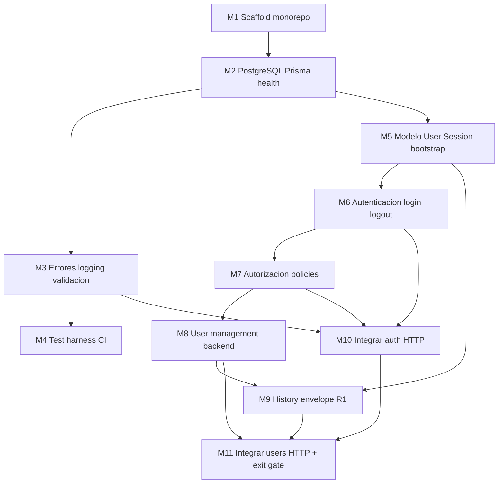

# Plan 001 — Release 1 Milestones: Foundation + Access and Users

**Release:** 1 — Application Foundation and Access (Local Development)  
**Estado:** Milestone 5 completado en local — Milestone 4 mantiene pendiente la verificación en GitHub
**Último milestone:** Milestone 11 — Integrar users HTTP + exit gate Release 1

---

## Contexto

- **Release activo:** Release 1 — Application Foundation and Access (Local Development) ([`../DEVELOPMENT_PLAN.md`](../DEVELOPMENT_PLAN.md) §Release 1).
- **Release 0:** COMPLETADO y aprobado.
- **Entorno:** desarrollo y pruebas **únicamente en local** durante Release 1. No hay staging ni producción.
- **Primer despliegue productivo:** después de completar Release 2 — Billing Core ([`../DEVELOPMENT_PLAN.md`](../DEVELOPMENT_PLAN.md) §First production deployment).
- **Features en alcance:** [`../FEATURES/01_ACCESS_AND_USERS.md`](../FEATURES/01_ACCESS_AND_USERS.md) + slice R1 de [`../FEATURES/14_HISTORY_ADMIN_AND_RECOVERY.md`](../FEATURES/14_HISTORY_ADMIN_AND_RECOVERY.md).
- **Frontend:** el prototipo mock de [`../plans_web/plan-001.md`](../plans_web/plan-001.md) está **cerrado** (WM12). Login, shell por rol, usuarios y perfil propio ya existen contra mocks (`VITE_USE_MOCK_API`). M10–M11 de este plan **no reconstruyen pantallas**; sustituyen el repositorio mock por HTTP.
- **Estado API:** M1–M3 y M5 completados en local; M4 mantiene pendientes externos. User/Session, repositorios y bootstrap CLI disponibles. Ningún endpoint de Access/Users existe todavía.
- **Ciclo por milestone:** plan → implementación → pruebas → revisión → commit. La integración web se hace **solo** cuando la función API cumple el criterio de la sección Integración API → Web.


## Alcance total de Release 1

| Incluido | Excluido |
|---|---|
| Scaffold FE/BE, Prisma, PostgreSQL local, validación, errores, tests, CI local | Facturas, clientes, inventario, Work Orders, fotos, CxC, CxP |
| Login por `username`, sesiones, roles, gestión de usuarios, autorización server-side | Dashboard KPIs del prototipo, recovery/diagnostics completos (Release 8) |
| History envelope + eventos de ciclo de vida de usuarios | Otros tipos de evento de negocio (Release 2+) |
| Bootstrap CLI del primer Administrator | Staging, producción, hosting, RPO/RTO, HTTPS productivo, backups gestionados, rollback productivo |
| Verificación en browser de flujos UI | Object storage (Release 4+) |

## Decisiones cerradas (fuente de verdad)

Documentadas en [`../FEATURES/01_ACCESS_AND_USERS.md`](../FEATURES/01_ACCESS_AND_USERS.md), [`../DEVELOPMENT_PLAN.md`](../DEVELOPMENT_PLAN.md), [`../FEATURES/14_HISTORY_ADMIN_AND_RECOVERY.md`](../FEATURES/14_HISTORY_ADMIN_AND_RECOVERY.md) y [`../INFRASTRUCTURE_PLAN.md`](../INFRASTRUCTURE_PLAN.md):

1. Login identity: `username` único.
2. Primer Administrator: comando CLI one-shot; rechaza si ya existen usuarios; sin credenciales hardcodeadas de producción.
3. Perfil MVP: `name`, `username`, `phone?`, `email?`, `role`, `active`, `passwordHash`, `createdAt`, `updatedAt`.
4. Contraseña MVP: mínimo 6 caracteres; sin reglas extra de complejidad.
5. Release 0 completado; Release 1 activo.
6. Hosting / RPO / RTO: pendientes; requeridos solo antes del primer despliegue productivo (post Release 2); **no bloquean Milestones 1–11**.
7. CI smoke R1: migraciones, `/health/live`, `/health/ready`, login, sesión, autorización.
8. Mechanic en R1: proyección mínima de sesión + tests negativos; proyección WO completa en release correspondiente.
9. History R1: envelope reutilizable + solo eventos de ciclo de vida de usuarios.
10. Feature 01: un feature de producto; módulos `access` y `users` compartiendo modelo/repositorio de usuario.
11. Integración web Release 1: el prototipo ya cubre la UI de Feature 01. No se cablea una función a HTTP hasta que el backend tenga el stack completo de esa función (ruta → controller → service → repository → validation → types + tests) **y** M3 haya fijado el contrato de errores. Pantallas de Releases 2–8 (clientes, facturas, inventario, OT, etc.) **permanecen en mock** aunque la UI exista.

## Integración API → Web (cuándo cablear)

El prototipo web ya está listo para Access/Users. El cuello de botella es la API, no la UI.

**Una función está lista para integrar** cuando se cumplen los tres lados:

| Lado | Listo cuando |
|---|---|
| API | Módulo con routes, controller, service, repository, validation, types; tests de la función; errores HTTP estables (M3) |
| Web | Pantalla/flujo + interfaz de repositorio + stub HTTP en `apps/web/src/api/` (ya cubierto por WM2/WM11/WM12 para auth, perfil y usuarios) |
| Alcance de release | La función pertenece a Release 1. Tener UI mock de un release posterior **no** autoriza a integrar esa API ahora ([`../DEVELOPMENT_PLAN.md`](../DEVELOPMENT_PLAN.md) §1.7) |

Hasta entonces: `VITE_USE_MOCK_API` distinto de `false` (mocks). No mezclar login real con listados mock de usuarios, ni al revés.

### Estado ahora (después de M5 en local)

**No hay función de Access/Users integrable.** El contrato de errores, los modelos User/Session, sus repositorios y el bootstrap CLI están listos. Faltan HTTP de auth, policies y gestión HTTP de usuarios.

| Función API | ¿Integrable ahora? | Motivo |
|---|---|---|
| `GET /api/health/live` | Opcional (ops) | API completa. El prototipo **ya no** tiene pantalla de health; no es Feature 01. Se puede usar a mano o en CI. |
| `GET /api/health/ready` | Opcional (ops) | Igual: readiness de PostgreSQL, no flujo de usuario. |
| Login / logout / sesión / perfil propio | No | No existen endpoints. UI lista (`/login`, shell, `/profile`, `/mechanic/profile`). |
| Gestión Administrator de usuarios | No | No existen endpoints. UI lista (`/users`). |
| History de usuarios | No | Envelope aún no existe. En R1 **no hay pantalla** de historial de usuarios; es persistencia + tests. |
| Clientes, facturas, inventario, OT, dashboard KPIs, recovery | No (fuera de R1) | UI mock existe; API y release correspondientes son R2+. |

### Matriz Release 1 — primer momento integrable

| Función | Componentes API | Componentes web (ya existen) | Primer momento integrable | Trabajo de integración |
|---|---|---|---|---|
| Health live/ready | M1–M2 | Ninguno de producto (se quitó el health check de WM1) | **Después de M2** (ya cumplido) | No hay slice de producto. Smoke/CI solamente. |
| Contrato de errores (`errorId`, 400/401/403/409/500) | M3 | Toasts / `Result<T, AppError>` | Después de M3 | No se “integra” una pantalla. M10–M11 **mapean** estos códigos. Sin M3 no se cablea auth. |
| Test harness / CI | M4 | — | Nunca a UI | Plantilla de smoke; se completa cuando existan login y policies. |
| User/Session + bootstrap CLI | M5 | — | Nunca a UI | Persistencia y CLI. El web sigue en mock hasta que haya HTTP. |
| `POST /api/auth/login`, `POST /api/auth/logout`, `GET /api/auth/session` | M6 | `AuthRepository`, `LoginForm`, `AuthContext`, `credentials: 'include'` previsto | **Después de M6** a nivel de cliente HTTP; **no** activar mock→HTTP de sesión hasta M7 | El swap real es M10. Tras M6 se puede implementar `auth-api.ts` contra el contrato, pero la proyección Mechanic/roles llega en M7. |
| `GET /api/auth/me`, `PATCH /api/auth/me` (perfil propio: name, phone, email, password; no username/rol/active) | M6 (mismo módulo `access`) | `ProfilePage`, `updateOwnProfile` | **Después de M6** (mismo corte que login) | Incluir estos endpoints en M6: el web ya los declara en `endpoint-map.ts`. Feature 01 checklist frontend. |
| Policies `requireRole` / proyección `/session` | M7 | Shell por rol, `policies.ts` (UX, no seguridad) | **Después de M7** | Primera integración de producto: M10. Login real + cookie + 401/403. |
| `POST/GET/PATCH` usuarios Administrator | M8 | `UserTable`, `UserFormModal`, `UserRepository` | **Después de M8** | Integración en M11. Alinear paths web (`/api/users`) vs este plan (`/api/admin/users`) en el cliente HTTP; **la API de este plan es la fuente HTTP**. |
| Eventos `USER_*` | M9 | Sin pantalla R1 | **No integrar UI en R1** | Append en la misma transacción que M8. El exit gate de M11 **verifica** eventos por API/tests, no por una vista nueva. |

### Qué hacer después de cada milestone

| Al terminar | Integrar a web | No integrar todavía |
|---|---|---|
| **M1** (hecho) | Health stub si la app era el placeholder | Auth, usuarios |
| **M2** (hecho) | Nada de producto. Health ready queda para CI/manual | Auth, usuarios. El prototipo web sigue 100 % mock |
| **M3** | Nada de pantallas. Deja el contrato de error que M10–M11 consumirán | Login HTTP |
| **M4** | Nada de UI | Login HTTP (los tests de smoke auth esperan M6–M7) |
| **M5** | Nada de UI. Bootstrap CLI crea el admin real para pruebas posteriores | Login HTTP |
| **M6** | **Preparar** `HttpAuthRepository` (login/logout/session/me/profile). Aún no poner `VITE_USE_MOCK_API=false` como default | Shell por rol contra proyección incompleta; usuarios admin |
| **M7** | Auth **queda integrable** (login/sesión/perfil/shell). En este plan el swap se hace en M10, después de M8, para probar los 3 roles con usuarios reales | `/users` (falta M8); cualquier pantalla R2+ |
| **M8** | Usuarios admin **quedan integrables**. El swap se hace en M11 (tras M10) | History UI; facturación |
| **M9** | Nada de UI nueva | Recovery/diagnostics (Release 8) |
| **M10** | Auth HTTP verificado en browser (3 roles) | Gestión de usuarios si M8 no está |
| **M11** | Usuarios HTTP + exit gate R1 | Release 2 (clientes/facturas) |

**Release 1 cerrado:** solo Access/Users (+ health + envelope de history) habla con API real. El resto del prototipo permanece mock hasta su release en [`../DEVELOPMENT_PLAN.md`](../DEVELOPMENT_PLAN.md).

## Diagrama de dependencias



## Milestones — estado

| ID | Milestone | Estado | Integración web |
|---|---|---|---|
| M1 | Scaffold monorepo FE/BE + convenciones + health stub | completado | Health stub (histórico; ya no es UI de producto) |
| M2 | PostgreSQL + Prisma + health readiness | completado | **Nada de producto.** Health solo CI/ops |
| M3 | Errores, logging, validación HTTP | completado | Contrato de errores; aún sin pantallas HTTP |
| M4 | Test harness + CI baseline (smoke R1) | en curso | Ninguna |
| M5 | Modelo User/Session + bootstrap CLI admin | completado en local | Ninguna (CLI, no HTTP) |
| M6 | Login/logout/sesiones + perfil propio (AUTH-001) | pendiente | Cliente HTTP auth **preparable**; swap no default |
| M7 | Autorización server-side (AUTH-002/005) | pendiente | **Listo para M10** (auth + shell) |
| M8 | User management backend (AUTH-003/004) | pendiente | **Listo para M11** (`/users`) |
| M9 | History envelope R1 + eventos de usuarios | pendiente | Sin UI R1; tests/API en el exit gate |
| M10 | Integrar auth HTTP (login/sesión/perfil/shell) | pendiente | Swap `AuthRepository` mock → HTTP |
| M11 | Integrar users HTTP + exit gate Release 1 | pendiente | Swap `UserRepository` mock → HTTP |

---

## Milestone 1 — Scaffold monorepo y convenciones

**Objetivo:** Crear la estructura mínima ejecutable del monolito modular (frontend + backend) con TypeScript, scripts de desarrollo y convención feature-based.

**Alcance:**
- `apps/web/` — React + Vite + TypeScript
- `apps/api/` — Node.js + Express + TypeScript
- ESLint + Prettier + `tsconfig` estricto
- Scripts: `dev`, `build`, `lint`, `typecheck`
- `.gitignore`, `.env.example` (nombres, sin secretos)
- README mínimo de arranque local

**Principales cambios esperados:**
- `package.json` raíz (npm workspaces recomendado)
- Express app vacía + Vite app placeholder
- Convención `feature/{routes,controller,service,repository,validation,types}` con stub `health`

**Dependencias / decisiones:**
- Same-origin en despliegue futuro; en local: proxy Vite → API o puertos coordinados

**Pruebas:**
- `npm run typecheck` y `npm run build` pasan
- Smoke manual: health stub responde

**Definición de terminado:**
- Clonar, instalar, ejecutar FE+BE en local, ver health check.
- Sin lógica de negocio ni BD.

**Integración web:** En su momento el placeholder consultaba `/api/health`. Ese UI ya no existe. No hay más que cablear de M1.

---

## Milestone 2 — PostgreSQL, Prisma y conectividad

**Objetivo:** Persistencia PostgreSQL local con Prisma, migraciones y health readiness.

**Alcance:**
- Cliente Prisma singleton + cierre graceful
- Migración inicial
- `GET /health/live` y `GET /health/ready`
- PostgreSQL local nativo o contenedor

**Principales cambios esperados:**
- `apps/api/src/infrastructure/database/`
- `DATABASE_URL` en `.env.example`
- Scripts `db:migrate`, `db:generate`

**Pruebas:**
- Integration: readiness falla sin BD, pasa con BD
- Migración aplicable en BD limpia

**Definición de terminado:**
- API reporta readiness real contra PostgreSQL local.
- Migraciones reproducibles desde cero.

**Integración web (después de M2 — estado actual):** **No se integra Access/Users.** Health live/ready quedan para smoke y diagnóstico. El prototipo web sigue enteramente en mock. No poner `VITE_USE_MOCK_API=false`.

---

## Milestone 3 — Errores, logging, validación HTTP

**Objetivo:** Infraestructura transversal: errores, middleware, logs estructurados, validación runtime.

**Alcance:**
- Taxonomía de errores de aplicación
- Correlation/request ID, error mapper, secure headers básicos
- Logger estructurado (Pino recomendado)
- Convención Zod en `validation/` por feature
- Respuestas con `errorId` seguro al cliente

**Pruebas:**
- Unit: mapeo error → status HTTP
- Integration: 400 consistente; 500 genérico + errorId

**Definición de terminado:**
- Pipeline estándar request → validate → controller → service operativo.
- Logs correlacionables por request ID.

**Integración web (después de M3):** **Aún no hay pantallas HTTP.** Este milestone desbloquea el mapeo de `errorId` / 400 / 401 / 403 / 409 / 500 que M10–M11 usarán. Sin este contrato no se cablea login.

---

## Milestone 4 — Test harness y CI baseline

**Avance local:** aislamiento de `DATABASE_URL_TEST`, fallo explícito si PostgreSQL
no está disponible, preparación global de integración con reset de la BD desechable
y reaplicación de migraciones, health real y respuestas HTTP negativas verificadas.
La suite API pasa con 43 pruebas unitarias y 15 de integración; el monorepo suma 501 pruebas.
Workflow GitHub Actions y smoke R1 documentados en
[`milestone-4-ci.md`](milestone-4-ci.md). Pendientes: primera ejecución verde en GitHub
y configuración/verificación del check obligatorio `R1 quality` para merge.
Se corrigieron las dependencias identificadas: `deepmerge-ts 8.0.0` mediante override
limitado a `@prisma/config@6.19.3`, y `qs 6.16.0`. npm 11.19.1 queda fijado para aplicar
el override correctamente en workspaces. La instalación limpia, Prisma, pruebas,
typecheck, lint y build pasan. El 2026-09-04, `npm audit --audit-level=high` completó
correctamente con cero vulnerabilidades. El gate de auditoría permanece obligatorio.
El usuario realizará el PR al terminar Release 1; no se abre un PR para M4 ahora.

**Objetivo:** Unit + integration contra PostgreSQL real; CI sin despliegue.

**Alcance:**
- Vitest (o Jest) + Supertest
- BD de test separada (`DATABASE_URL_TEST`)
- GitHub Actions: install → lint → typecheck → unit → integration → build
- **Smoke R1 en CI:** migraciones, `/health/live`, `/health/ready`, login, sesión, autorización (cuando existan en milestones posteriores; plantilla lista desde M4, completada en M6–M7)

**Pruebas:**
- CI verde
- Integration test health/ready como plantilla

**Definición de terminado:**
- CI bloquea merge si falla typecheck o tests.
- Smoke scope R1 documentado y automatizable.

**Integración web (después de M4):** Ninguna. El smoke de login/sesión se rellena cuando existan M6–M7; no adelantar UI.

---

## Milestone 5 — Modelo User + Session + bootstrap CLI

**Avance — paso 2 implementado:** modelos Prisma `User`, `Session` y enum `Role`,
con UUID generados en PostgreSQL, timestamps con zona horaria, índices y FK con
borrado restringido. La migración exige usernames no vacíos, en minúsculas y sin
espacios exteriores; `Session` almacena `tokenHash` único. Restricciones verificadas
con pruebas de integración sobre PostgreSQL.

**Avance — paso 3 implementado:** validación Zod reutilizable para creación de
usuarios: nombre requerido, username normalizado, roles cerrados y contacto opcional
(vacío a `null`, email validado). Se rechazan campos ajenos al input de creación.
Contraseña de al menos 6 caracteres Unicode, sin transformaciones ni complejidad
adicional. Hashing/verificación con Argon2id (19 MiB, 2 iteraciones, paralelismo 1),
salt aleatorio por hash y errores internos sin secretos. Pruebas unitarias con
Argon2 real.

**Avance — paso 4 implementado:** `UserRepository` compartible por `access` y `users`,
con creación a partir de passwordHash, consultas por ID/username, comprobación de
existencia incluyendo inactivos y actualización de active sin borrado. Acepta cliente
Prisma de transacción; commit y rollback verificados contra PostgreSQL, junto con
unicidad y conservación de identidad. Devuelve registros internos con hash, que no
deben exponerse en HTTP ni logs. Validación, autorización, hashing e invalidación de
sesiones se coordinan desde servicios.

**Avance — paso 5 implementado:** `SessionRepository` permite crear sesiones con
tokenHash, userId y expiresAt, consultar por hash, revocar una sesión o todas las de
un usuario. Las revocaciones son idempotentes y devuelven el número de registros
eliminados. Acepta cliente transaccional; persistencia, aislamiento entre usuarios y
rollback conjunto con cambios de usuario probados en PostgreSQL. La consulta devuelve
el registro persistido, incluso expirado: expiración y estado activo se validarán en
el servicio de autenticación de M6. No se generan tokens ni cookies todavía.

**Avance — paso 6 implementado:** `npm run bootstrap:admin` solicita datos y contraseña
oculta con confirmación, sin argumentos ni entrada por pipes. Crea un Administrator
activo, con Argon2id, solo si no existe ningún usuario; comprobación y creación en
transacción serializable, con rechazo seguro de conflictos concurrentes. Sin sesión,
sin credenciales predefinidas ni secretos en salida; cierre de conexión y cancelación
de entrada probados. Pruebas de base vacía, cuenta previa activa/inactiva, validación
y dos bootstraps simultáneos. Uso documentado en README. No se creó administrador
de desarrollo durante la implementación.

**Paso 7 — verificación local completada (2026-09-04):** 580 pruebas aprobadas
(85 unitarias API, 52 integración API y 443 web), typecheck de aplicaciones y tests,
lint sin errores y build de ambos workspaces correctos. Migraciones reaplicadas desde
cero únicamente en la base de pruebas. Se mantienen 4 advertencias de lint web y la
advertencia de tamaño del bundle web. El 2026-09-04,
`npm audit --audit-level=high` completó correctamente con cero vulnerabilidades;
esto no equivale a una ejecución aprobada del workflow remoto de CI.
Evidencia y límites en [`milestone-5-verification.md`](milestone-5-verification.md).
M5 cumple su definición de terminado local; siguen pendientes los gates externos de M4.

**Objetivo:** Modelar usuarios, roles, sesiones y bootstrap del primer Administrator.

**Alcance:**
- Campos MVP confirmados: `name`, `username` (unique), `phone?`, `email?`, `role`, `active`, `passwordHash`, `createdAt`, `updatedAt`
- Enum rol: `ADMINISTRATOR`, `SELLER`, `MECHANIC`
- Tabla `Session`: token opaco, `userId`, `expiresAt`
- Repositorios en módulos `access` y `users` (compartiendo modelo User)
- **CLI bootstrap one-shot:** crea primer Administrator solo si no existen usuarios; rechaza si ya hay usuarios; sin credenciales hardcodeadas de producción
- Validación contraseña: mínimo 6 caracteres

**Dependencias / decisiones:**
- Argon2id implementado: 19 MiB de memoria, 2 iteraciones y paralelismo 1; salt aleatorio por hash.

**Pruebas:**
- Unique constraint en `username`
- Usuario inactive no borrado físicamente
- Bootstrap exitoso en BD vacía; rechazo si ya hay usuarios

**Definición de terminado:**
- Migración User + Session con FKs e índices.
- Bootstrap CLI documentado y testeado.
- Repositorios testeados sin HTTP de auth aún.

**Integración web (después de M5):** Ninguna. No hay rutas HTTP. El CLI deja el primer Administrator para cuando M6 exista; el login de la web sigue siendo mock (`admin` / `demo1234` no es el usuario de PostgreSQL).

---

## Milestone 6 — Autenticación: login, logout, sesiones (AUTH-001)

**Objetivo:** Login por `username` + password; sesiones same-origin con cookie HttpOnly.

**Alcance:**
- `POST /api/auth/login` — verificación credenciales, sesión nueva, rotación
- `POST /api/auth/logout`
- `GET /api/auth/session`
- `GET /api/auth/me` — usuario de la sesión (sin `passwordHash`)
- `PATCH /api/auth/me` — perfil propio: `name`, `phone?`, `email?`, cambio de password (mínimo 6; requiere password actual). **No** acepta `username`, `role` ni `active` del cliente (eso es M8 / `users.manage`)
- Cookie: `HttpOnly`, `SameSite` explícito; `Secure` solo en despliegue HTTPS futuro
- Sesiones en PostgreSQL
- Rate limiting + mensaje genérico en login fallido
- Rechazar login si cuenta inactive
- Middleware `requireAuth` + recheck active user

**Dependencias / decisiones:**
- CSRF para mutaciones — decidir en plan del milestone

**Pruebas:**
- Login válido → cookie + session OK
- Credenciales inválidas / inactive → rechazo
- Logout invalida sesión
- Sin password/hash en responses ni logs
- PATCH propio: actualiza contacto; rechaza username/rol/active; password corta o actual incorrecta → 400

**Definición de terminado:**
- AUTH-001 cubierto por tests automatizados vía API.
- Perfil propio cubierto por tests (validación + rechazo de campos de cuenta).

**Integración web (después de M6):** **Preparable, no default.** Implementar `apps/web/src/api/client/auth-api.ts` contra estos paths. No activar `VITE_USE_MOCK_API=false` hasta M7/M10: falta proyección por rol y denegaciones 403. No cablear `/users`.

---

## Milestone 7 — Autorización server-side (AUTH-002, AUTH-005)

**Objetivo:** Enforcement de roles en servidor; base para matriz de [`../ROLES_AND_PERMISSIONS.md`](../ROLES_AND_PERMISSIONS.md).

**Alcance:**
- Helpers/policies: `requireRole(...)`, `requireAdministrator`
- Proyección mínima por rol en `/api/auth/session`:
  - Mechanic: solo datos mínimos de sesión (`id`, `username`, `name`, `role`) — **sin datos comerciales**
  - Seller/Administrator: proyección de perfil acorde al rol
- Rutas protegidas placeholder para tests negativos
- Documentar que proyección WO completa queda para release de Work Orders

**Pruebas:**
- Seller/Mechanic → 403 en ruta admin-only
- Administrator → 200
- Request sin sesión → 401

**Definición de terminado:**
- Tests negativos de rol vía Supertest.
- Mechanic verificado solo con proyección mínima + denegaciones.

**Integración web (después de M7):** **Sí — ejecutar M10.** Login, logout, sesión, perfil propio y shell por rol pueden dejar el mock. Mechanic no debe recibir datos comerciales en `/session` ni `/me`. `/users` espera M8.

---

## Milestone 8 — Gestión de usuarios Administrator (backend, AUTH-003/004)

**Objetivo:** CRUD operacional de cuentas en módulo `users`; deactivación sin borrado físico.

**Alcance:**
- `POST /api/admin/users` — crear (`name`, `username`, password, role, optional phone/email)
- `GET /api/admin/users` — listar paginado
- `PATCH /api/admin/users/:id` — rol, activar/desactivar, editar perfil permitido
- Solo Administrator
- `username` único
- Deactivación soft; invalidar sesiones al desactivar
- Contraseña mínima 6 caracteres en creación/cambio

**Principales cambios esperados:**
- `users/{routes,controller,service,validation,types}`

**Pruebas:**
- Admin crea usuarios con cada rol
- Seller/Mechanic → 403
- Duplicate username → 409
- Deactivate → login bloqueado + sesiones invalidadas
- Usuario desactivado permanece en BD

**Definición de terminado:**
- Checklist backend Feature 01 completo excepto history events (M9).
- API usable sin frontend.

**Integración web (después de M8):** **Sí — ejecutar M11** para `/users`. El cliente HTTP debe hablar con `/api/admin/users` (este plan), aunque el mapa mock del web diga `/api/users`. Create vs update: el web usa un `save()` único; el cliente parte create (`POST`) y patch (`PATCH`). No integrar clientes/facturas.

---

## Milestone 9 — History mínimo Release 1 (HIST-001/002 slice)

**Objetivo:** Envelope reutilizable + eventos de administración de usuarios.

**Alcance:**
- Tabla event envelope: `occurredAt`, `actorUserId` (FK User), `eventType`, `subjectType`, `subjectId`, `payload`
- Tipos R1: `USER_CREATED`, `USER_ROLE_CHANGED`, `USER_ACTIVATED`, `USER_DEACTIVATED`
- Append en misma transacción que mutación de usuario
- Actor desactivado sigue resolviendo en lectura histórica

**Pruebas:**
- Crear/desactivar → eventos append-only
- Actor desactivado resoluble en eventos previos
- Operación fallida → sin evento de éxito

**Definición de terminado:**
- AUTH-004 + HIST-002 demostrables con integration test.
- Sin recovery/diagnostics/otros eventos.

**Integración web (después de M9):** **Ninguna pantalla nueva.** Release 1 no tiene timeline de usuarios. M11 comprueba eventos con tests/API (crear/desactivar produce `USER_*`). Recovery UI del prototipo sigue mock (Release 8).

---

## Milestone 10 — Integrar auth HTTP: login, sesión, perfil y shell

**Objetivo:** Sustituir el mock de `AuthRepository` por la API de M6–M7. La UI de login/shell/perfil **ya existe** (prototipo WM2 + perfil); no se rediseña.

**Alcance:**
- Implementar `HttpAuthRepository` / `auth-api.ts`: login, logout, session, me, `updateOwnProfile`
- `credentials: 'include'` y manejo de cookie HttpOnly
- Mapear 401 (sesión expirada / inactive) y errores de validación a la UX existente
- App shell por rol usando la proyección de `/api/auth/session` (Admin → Users en nav; Seller/Mechanic shells ya montados)
- Mechanic: sin datos comerciales en la sesión HTTP
- Route guards UX complementarios (la seguridad sigue en el servidor)
- Verificación en browser obligatoria
- Default de desarrollo puede seguir en mock hasta que este milestone esté verde; entonces auth R1 usa API real

**Pruebas:**
- Browser: login/logout por 3 roles con usuarios de bootstrap/M8 (no las credenciales demo del mock)
- Mechanic no ve nav admin/comercial
- Perfil propio persiste tras recargar

**Definición de terminado:**
- Checklist frontend Feature 01 de login/logout/session/nav/perfil contra API local.
- Inventario, ventas, clientes, OT, etc. **siguen en mock**.

**Integración web (este milestone):** **Hacer el swap de auth.** No swap de `UserRepository` si M8 no está cerrado.

---

## Milestone 11 — Integrar users HTTP + exit gate Release 1

**Objetivo:** Sustituir el mock de `UserRepository` por la API de M8 y cerrar Release 1 en local.

**Alcance:**
- `HttpUserRepository`: list → `GET /api/admin/users`; create → `POST`; update/deactivate/role → `PATCH /api/admin/users/:id`
- Listado: `name`, `username`, rol, estado, phone/email si existen
- Errores 409/403/validation en la UI existente (`UserFormModal` / toasts)
- Actualizar checklists Feature 01 y slice R1 de Feature 14
- Confirmar que history `USER_*` se escribe (tests/API), sin pantalla nueva de historial

**Pruebas:**
- Browser E2E local: Admin crea Seller, desactiva, login falla
- Seller intenta ruta admin → 403 API + UX coherente
- Suite CI smoke R1 completa: migraciones, health, login, sesión, autorización
- Feature 01 acceptance criteria verificables end-to-end en local

**Definición de terminado (exit gate Release 1):**
- Access and Users completamente funcional y probado en **entorno local**.
- Roles autentican localmente; requests directos no autorizados fallan.
- Migraciones limpias en BD local fresca.
- **Último milestone de Release 1.** No iniciar implementación de API de Release 2 hasta aprobación explícita. Las pantallas R2+ del prototipo permanecen mock.

**Integración web (este milestone):** **Hacer el swap de usuarios.** Nada de clientes, facturas ni inventario.

---

## Orden de ejecución

Secuencial: **M1 → M2 → M3 → M4 → M5 → M6 → M7 → M8 → M9 → M10 → M11**.

El prototipo web no es dependencia: M10/M11 son swaps HTTP. En la secuencia de este plan, M10 va **después de M8** para poder verificar Administrator, Seller y Mechanic con cuentas de PostgreSQL (el CLI de M5 solo crea el primer Administrator). M11 espera M8 + M10; M9 debe estar hecho para el exit gate (eventos), no para pintar `/users`.

Tras **cerrar Release 1**, la siguiente integración web de negocio es Release 2 (clientes/facturas), no un cableado anticipado del prototipo.

## Qué NO planificar aquí

- Clientes, facturas, inventario, reservas, pagos, Work Orders, fotos, PDFs, CxC, CxP
- Staging, producción, hosting, RPO/RTO, backups gestionados, rollback productivo (→ antes del primer despliegue, post Release 2)

## Próximo paso

**Milestone 6:** Planificar autenticación HTTP, cookies, expiración de sesiones, CSRF,
rate limiting y perfil propio antes de implementarlos. El administrador local se puede
crear con `npm run bootstrap:admin` cuando se necesite; no es obligatorio para cerrar M5.

**Pendientes de Milestone 4:** verificar el primer PR en GitHub y configurar el check
obligatorio `R1 quality`. Se mantiene la decisión de
hacer el PR al terminar Release 1.

No integrar Access/Users a la web: el prototipo permanece en mock hasta M10–M11.

Antes de seguir, asegúrate de tener `.env` con un `DATABASE_URL` válido, la base `truck_parts_dev` creada, y haber corrido:

```bash
npm run db:migrate:deploy
```

Luego `GET /api/health/ready` debe responder `200` con `"database": "up"`.
