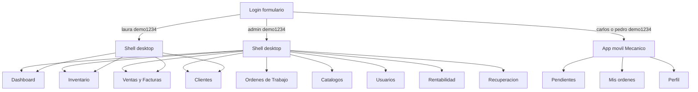
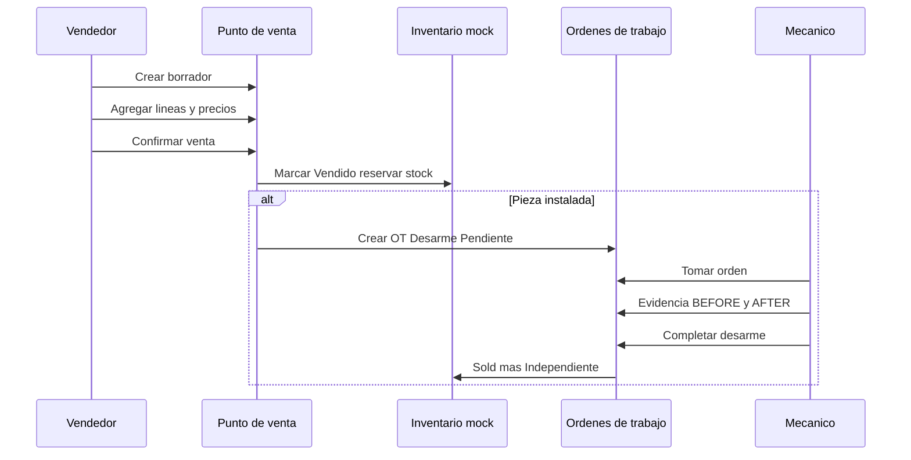
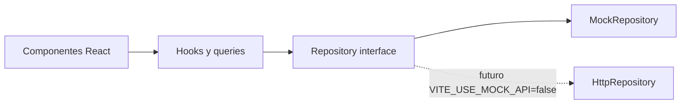
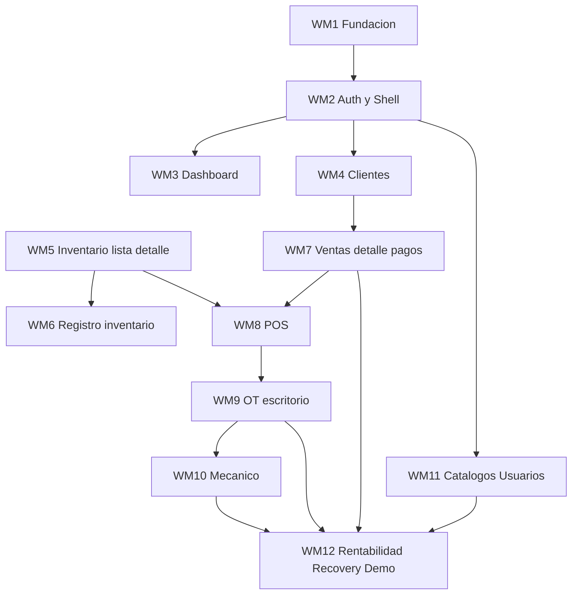

# Plan 001 — Frontend Prototipo Mock: SoloCamiones

**Alcance:** Prototipo frontend funcional con datos dummy (sin backend)  
**Estado:** WM7 completado — WM8 pendiente
**Último milestone planificado:** WM12 — Rentabilidad, recuperación, escenarios demo y preparación API  
**Referencia de diseño:** [Prototipo Figma Make](https://www.figma.com/make/HzibQNQ88lqtv3rAup56eJ/Follow-prototype-instructions)

---

## Contexto

- **Objetivo:** Construir en `[apps/web](../../apps/web)` un prototipo operativo que reproduzca el diseño y los flujos del Figma Make, usando datos mock realistas y preparado para sustituir mocks por llamadas HTTP con cambios mínimos.
- **Estado actual del frontend:** scaffold mínimo (health check contra `/api/health/live`); sin Tailwind, sin routing, sin pantallas de negocio.
- **No implementa backend** en este plan. La integración con API real se hará milestone a milestone cuando existan los endpoints (ver relación con `[../plans_api/plan-001.md](../plans_api/plan-001.md)` M10–M11).
- **Documentos de referencia:**
  - `[../PROTOTYPE_PLAN.md](../PROTOTYPE_PLAN.md)` — intención UX y flujos validados
  - `[../ROLES_AND_PERMISSIONS.md](../ROLES_AND_PERMISSIONS.md)` — matriz de permisos
  - `[../ARCHITECTURE_PLAN.md](../ARCHITECTURE_PLAN.md)` — stack y dirección frontend
  - `[../DEVELOPMENT_PLAN.md](../DEVELOPMENT_PLAN.md)` — orden de entrega productivo (este plan cubre el prototipo completo, no solo Release 1)

### Principio rector

El prototipo Figma es referencia de **diseño y flujo**, no de implementación. Donde el Make tenga baches de lógica o seguridad, esta implementación los corrige siguiendo las specs del proyecto, **sin cambiar la intención visual** del prototipo.

---

## Alcance total

| Incluido                                                          | Excluido                                                      |
| ----------------------------------------------------------------- | ------------------------------------------------------------- |
| 14 pantallas / flujos del prototipo Make                          | Backend, Prisma, sesiones HTTP reales                         |
| Datos mock separados de componentes UI                            | Integración DGII / NCF / e-CF                                 |
| Login por formulario con 4 usuarios seed                          | Subida real de fotos a S3                                     |
| Admin puede crear usuarios en memoria                             | Procesamiento real de pagos                                   |
| Lógica de negocio en servicios mock validados                     | Controles demo en build productivo                            |
| Endurecimiento vs. baches del Make (auth, permisos, validaciones) | Tests E2E automatizados (recomendados desde WM7; no bloquean) |
| Preparación `VITE_USE_MOCK_API` + stubs HTTP                      | Copiar el monolito `store.tsx` del Make                       |

---

## Decisiones cerradas

1. **Stack:** React 19 + TypeScript + Vite + Tailwind CSS v4 + React Router.
2. **Arquitectura:** feature-based; repositorios con interfaz; mocks en `mocks/`; UI sin reglas de negocio.
3. **Login:** solo formulario `username` + `password`. **No** botones “Entrar” por tarjeta como en Figma.
4. **Usuarios seed:** exactamente 4 (1 Admin, 1 Vendedor, 2 Mecánicos). Contraseña seed: `demo1234`.
5. **Credenciales visibles en login** como referencia; el usuario debe escribirlas manualmente.
6. **Sin “cambio de rol” en header.** Para cambiar de rol: logout + login con otro usuario.
7. **Admin puede crear usuarios** adicionales con contraseña asignada; persisten en memoria hasta reinicio demo.
8. **Controles demo** (reset de datos, 12 escenarios): solo `DEV` o flag explícita; no omiten login.
9. **Autorización:** `policies.ts` + validación en servicios mock; guards de ruta como capa UX adicional.
10. **Mecánico:** proyección de datos sin campos comerciales en repositorio, no solo ocultos en UI.
11. **ITBIS:** solo se aplica **18%** cuando el borrador/factura tiene activado **“Factura con comprobante fiscal”** (`fiscal: true`). Si no está activado, **ITBIS = 0** en todas las líneas (el total coincide con la suma de precios finales). El cálculo vive en el servicio mock, no en la UI. _Refinamiento respecto al Figma Make, que mostraba ITBIS en líneas gravadas aunque la factura no fuera fiscal._

### Usuarios seed (WM2)

| Rol           | Nombre             | `username` | Contraseña | Notas                                                |
| ------------- | ------------------ | ---------- | ---------- | ---------------------------------------------------- |
| Administrador | Administrador Demo | `admin`    | `demo1234` | 9 secciones en sidebar; puede crear usuarios (WM11)  |
| Vendedor      | Laura Pérez        | `laura`    | `demo1234` | 4 secciones: Dashboard, Inventario, Ventas, Clientes |
| Mecánico      | Carlos Méndez      | `carlos`   | `demo1234` | App móvil separada                                   |
| Mecánico      | Pedro Santana      | `pedro`    | `demo1234` | App móvil; OT seed OD-DEMO-060 asignada              |

---

## Inventario del prototipo

### Pantallas

| #   | Pantalla                      | Ruta planificada   | Roles              |
| --- | ----------------------------- | ------------------ | ------------------ |
| 1   | Login                         | `/login`           | todos (sin sesión) |
| 2   | Shell desktop                 | layout             | Admin, Vendedor    |
| 3   | Dashboard                     | `/dashboard`       | Admin, Vendedor    |
| 4   | Inventario                    | `/inventory`       | Admin, Vendedor    |
| 5   | Detalle de ítem               | `/inventory/:id`   | Admin, Vendedor    |
| 6   | Ventas y Facturas             | `/sales`           | Admin, Vendedor    |
| 7   | Detalle de factura            | `/sales/:id`       | Admin, Vendedor    |
| 8   | Punto de venta (borrador)     | `/sales/draft/:id` | Admin, Vendedor    |
| 9   | Clientes                      | `/customers`       | Admin, Vendedor    |
| 10  | Órdenes de trabajo            | `/work-orders`     | Admin              |
| 11  | Catálogos                     | `/catalogs`        | Admin              |
| 12  | Usuarios                      | `/users`           | Admin              |
| 13  | Rentabilidad                  | `/profitability`   | Admin              |
| 14  | Administración y Recuperación | `/recovery`        | Admin              |
| 15  | App Mecánico                  | `/mechanic/*`      | Mecánico           |

Modales relevantes (no son rutas propias): Registrar inventario, agregar línea POS, confirmar venta, registrar pago, cancelar factura, corregir moneda, vista PDF, crear OT, formularios de cliente/usuario/categoría.

### Navegación por rol



### Flujos principales de negocio



1. **Login** → formulario + credenciales de referencia / escenarios demo (WM12)
2. **Inventario** → búsqueda → detalle → agregar a borrador / OT manual (admin)
3. **Venta** → borrador → POS → 6 tipos de línea → confirmar → `FAC-` → detalle
4. **Pieza instalada** → advertencia → confirmar → `Vendido + Instalado` → OT Desarme
5. **Pagos** → parcial / múltiple → saldo en detalle y dashboard
6. **Cancelación** → admin → ramas según OT → reembolso opcional
7. **Mecánico** → claim → evidencia → completar → cambio físico
8. **Registro** → individual / cantidad / ensamblaje (2 pasos, baseline)
9. **Recuperación** → liberar reservas, reintentar FX, gestionar OT

---

## Endurecimiento vs. prototipo Figma Make

El Make concentra estado, reglas y UI en `store.tsx`. La autorización es casi solo visual. **No se copia ese patrón.**

### Reglas transversales

| Área              | Bache en Figma Make                   | Corrección en este plan                                                              |
| ----------------- | ------------------------------------- | ------------------------------------------------------------------------------------ |
| Autorización      | Ocultar menú ≠ seguridad              | `shared/auth/policies.ts` + validación en servicios mock antes de cada mutación      |
| Datos sensibles   | Mecánico podría ver costos vía estado | Proyecciones por rol en repositorios (`MechanicWorkOrderView` sin datos comerciales) |
| Lógica de negocio | Todo en `store.tsx`                   | `mocks/services/` con funciones puras; componentes solo orquestan UI                 |
| Demo / auth       | `loginAs(role)` y botones por usuario | Login solo por formulario; demo-controls sin bypass de sesión                        |
| Errores           | Toasts genéricos                      | `Result<T, AppError>` tipado; mensajes en español                                    |
| Estado obsoleto   | UI desactualizada                     | Invalidar/refetch tras mutación; deshabilitar acciones en vuelo                      |
| Unicidad          | IDs duplicables                       | Validar unicidad de ítem, username, secuencia `FAC-`                                 |

### Correcciones por dominio

**Auth (WM2):** 4 usuarios seed; login por formulario; credenciales incorrectas → error; inactivo → bloqueado; logout obligatorio para cambiar rol.

**Inventario (WM5–WM6):** `No desarmar` en servicio; ubicación efectiva centralizada; ajuste cantidad ≥ reservado; checklist completo en ensamblaje.

**Ventas (WM7–WM8):** revalidar líneas al confirmar; **ITBIS 18% solo si** `fiscal: true` (si no, ITBIS 0); cálculo centralizado en servicio; pago ≤ saldo; reembolso ≤ pagado; corrección moneda solo admin sin pagos.

**Órdenes (WM9–WM10):** `takeOrder` atómico; completar solo asignado con evidencia; venta ensamblaje bloqueada si OT activa en subárbol.

**Rentabilidad (WM12):** nunca en proyecciones de Vendedor/Mecánico; recuperación con historial aditivo.

---

## Arquitectura (mock → API)

### Estructura de carpetas

```
apps/web/src/
  shared/
    ui/                 # Button, Card, Chip, Modal, Field, Input, ...
    domain/             # CommercialChip, Timeline, money(), ...
    layout/             # AppShell, PageHeader, ProtectedRoute
    auth/
      policies.ts       # can(user, action, context)
      guards.tsx
  api/
    contracts/          # interfaces TypeScript = futuro contrato HTTP
    client/             # fetch wrapper (stub inicial)
  mocks/
    data/
      seed.ts           # datos iniciales
    repositories/       # Mock*Repository (in-memory + proyecciones por rol)
    services/           # lógica de negocio validada
    scenarios/          # 12 escenarios demo (WM12)
    demo-controls.ts    # reset datos; solo DEV — sin bypass login
  features/
    auth/
    dashboard/
    inventory/
    sales/
    customers/
    work-orders/
    mechanic/
    catalogs/
    users/
    profitability/
    admin-recovery/
```

### Patrón repositorio



**Regla:** los componentes de feature **nunca** importan `seed.ts` ni contienen reglas de negocio. Solo llaman hooks → repositorios → servicios.

### Componentes reutilizables

| Capa             | Componentes                                                                                                                                      |
| ---------------- | ------------------------------------------------------------------------------------------------------------------------------------------------ |
| `shared/ui`      | `Button`, `Card`, `Chip`, `Modal`, `Field`, `Input`, `Select`, `Textarea`, `Info`, `Empty`, `Toaster`, `SectionTitle`, `Mono`, `money()`         |
| `shared/domain`  | `CommercialChip`, `RelationChip`, `CompleteChip`, `NoDesarmarChip`, `InvoiceStatusChip`, `PaymentChip`, `WOStatusChip`, `WOTypeChip`, `Timeline` |
| `shared/layout`  | `AppShell`, `PageHeader`, `KpiCard`, `DataTable`, `FilterBar`, `TabBar`, `ProtectedRoute`                                                        |
| Feature-specific | `PhotoEditor`, `AssemblyTree`, `CustomerForm`, `UserForm`, `PayModal`, `ConfirmSaleModal`, `OrderCard`, `LoginForm`, `DemoCredentialsPanel`      |

### Entidades mock

`User`, `Item`, `QtyProduct`, `Customer`, `Category`, `Service`, `Invoice`, `Line`, `Payment`, `WorkOrder`, `Event`, más `fxAvailable`, `facSeq`.

**Dataset seed:** jerarquía TRK-001→ENG-001→piezas (transmisión faltante), ENG-002 incompleto e independiente, ENG-003 `No desarmar` independiente, 2 productos cantidad, 3 clientes, 5 facturas, 4 OT, 4 usuarios.

### Relación con plan API (Release 1)

| Web milestone   | API milestone | Notas                                               |
| --------------- | ------------- | --------------------------------------------------- |
| WM2             | M10           | Login, shell, guards UX                             |
| WM11 (usuarios) | M11           | Gestión usuarios; swap mock → HTTP cuando API lista |

El resto del prototipo (inventario, ventas, OT, etc.) permanece mock hasta los releases API correspondientes en `[../DEVELOPMENT_PLAN.md](../DEVELOPMENT_PLAN.md)`.

---

## Milestones — estado

| ID   | Milestone                                              | Estado     |
| ---- | ------------------------------------------------------ | ---------- |
| WM1  | Fundación, diseño y capa mock                          | completado |
| WM2  | Login por formulario, shell por rol, guards + policies | completado |
| WM3  | Dashboard operativo                                    | completado |
| WM4  | Clientes                                               | completado |
| WM5  | Inventario listado, búsqueda y detalle                 | completado |
| WM6  | Registro de inventario                                 | completado |
| WM7  | Ventas: listado, detalle, pagos, cancelación, PDF      | completado |
| WM8  | Punto de venta y borradores (POS)                      | pendiente  |
| WM9  | Órdenes de trabajo (escritorio)                        | pendiente  |
| WM10 | Experiencia Mecánico (móvil)                           | pendiente  |
| WM11 | Catálogos y usuarios (admin)                           | pendiente  |
| WM12 | Rentabilidad, recuperación, escenarios demo, prep API  | pendiente  |

### Diagrama de dependencias



**Ruta crítica de valor:** WM1 → WM2 → WM4 → WM5 → WM8 → WM7 → WM10

**Paralelizable tras WM2:** WM3, WM4, WM11 (parcial)

**Ciclo por milestone:** plan → implementación → verificación manual → actualizar `[../done_web/](../done_web/)` → commit

---

## WM1 — Fundación, diseño y capa de datos mock

**Objetivo:** Base ejecutable con design system, contratos, seed y arquitectura mock→API.

### Pantallas

Ninguna de negocio (placeholder de verificación).

### Funcionalidades

- Estructura feature-based en `apps/web`
- Tailwind v4 + tokens SoloCamiones (navy, brand, amber, Inter, JetBrains Mono)
- Design system base en `shared/ui`
- Contratos en `api/contracts/`
- `mocks/data/seed.ts` portado del prototipo (4 usuarios, no 5)
- Interfaces de repositorio + esqueletos `Mock*Repository`
- `shared/auth/policies.ts` esqueleto + tipo `Result<T, AppError>`
- React Router configurado

### Componentes reutilizables

Todo `shared/ui` base + `shared/layout/AppLayout` vacío.

### Datos mock

`createInitialState()` con seed completo importable.

### Criterios de aceptación

- [x] `npm run dev` muestra UI con tokens SoloCamiones
- [x] Seed carga sin errores; `npm run typecheck` pasa
- [x] Ningún feature importa `seed.ts` directamente
- [x] Ningún componente contiene reglas de negocio
- [x] Este documento refleja convención mock→API

---

## WM2 — Autenticación, shell y navegación por rol

**Objetivo:** Login realista por formulario, shell por rol, guards y policies.

### Pantallas

- Login (`/login`)
- Shell desktop (layout Admin/Vendedor)
- Redirect a app Mecánico (`/mechanic`)

### Funcionalidades

- Formulario: `username` + `password` + “Iniciar sesión”
- Panel “Usuarios de prueba” con las 4 credenciales seed visibles
- Sin botones “Entrar” por tarjeta (diferente a Figma)
- Usuario inactivo bloqueado
- Sesión mock + logout
- Sidebar: 9 ítems (Admin) / 4 ítems (Vendedor)
- Header con menú usuario; **sin** cambio de rol
- `ProtectedRoute` + `policies.ts` en mutaciones
- Demo: reinicio de datos y estructura de escenarios (lógica WM12)

### Componentes

`LoginPage`, `LoginForm`, `DemoCredentialsPanel`, `AppShell`, `RoleNav`, `UserMenu`, `DemoControls`, `ProtectedRoute`.

### Datos mock

`AuthRepository.login(username, password)`, `logout`, `getSession`. Contraseñas texto plano solo en mock local.

### Criterios de aceptación

- [x] Credenciales seed visibles y funcionan al escribirlas manualmente
- [x] Credenciales incorrectas → error, sin sesión
- [x] Admin: 9 secciones; Vendedor: 4; Mecánico: app separada
- [x] Usuario inactivo no entra
- [x] Vendedor en `/users` o `/profitability` → redirect + mensaje
- [x] Servicios mock rechazan mutaciones sin permiso
- [x] Interfaz lista para `POST /api/auth/login` futuro

---

## WM3 — Dashboard operativo

**Objetivo:** Panel resumen según rol.

### Pantallas

- Dashboard (`/dashboard`)

### Funcionalidades

- KPIs fila 1: inventario disponible, facturas hoy, saldo pendiente, borradores (Vendedor) o utilidad DOP (Admin)
- KPIs fila 2: desarmes pendientes, OT en proceso, ensamblajes incompletos, FX pendiente (Admin)
- Facturas recientes (clic → detalle)
- Timeline de actividad

### Componentes

`KpiCard`, `RecentInvoicesList`, `ActivityTimeline`.

### Datos mock

Agregaciones sobre `items`, `invoices`, `workOrders`, `events`.

### Criterios de aceptación

- [x] KPIs distintos Admin vs Vendedor
- [x] Números coinciden con seed tras reinicio
- [x] Clic en factura navega a detalle

---

## WM4 — Clientes

**Objetivo:** CRUD de clientes para facturación.

### Pantallas

- Clientes (`/customers`) + modal crear/editar

### Funcionalidades

- Búsqueda por nombre o RNC
- Listado con conteo de facturas
- Crear/editar (excepto `Cliente Contado` C0)
- C0 marcado como predeterminado

### Componentes

`CustomerTable`, `CustomerFormModal`, `SearchInput`.

### Datos mock

`CustomerRepository.list`, `search`, `save`.

### Criterios de aceptación

- [x] CRUD persiste en sesión mock
- [x] C0 no editable
- [ ] Cliente nuevo aparece en selector POS (WM8)

---

## WM5 — Inventario: listado, búsqueda y detalle

**Objetivo:** Explorar inventario individual y por cantidad.

### Pantallas

- Inventario (`/inventory`)
- Detalle ítem (`/inventory/:id`) — individual y cantidad

### Funcionalidades

- Tabla unificada piezas + productos cantidad
- Búsqueda multi-campo, filtro categoría, toggle vendidos
- Chips: comercial, relación física, completitud, reserva, `No desarmar`
- Detalle: jerarquía, estado, ubicación efectiva, fotos placeholder, costo, OT, historial
- Acciones: agregar a borrador; admin: OT manual, `No desarmar`, corrección costo/baseline

### Componentes

`InventoryTable`, `InventoryFilters`, `ItemDetailPage`, `QtyProductDetail`, `HierarchyTree`, `StatusPanel`, `PhotoGrid`, chips de dominio.

### Datos mock

`items`, `qty`, `categories`, `workOrders`, `events`; helpers `effectiveLocation`, `isComplete`, `protectedAncestor`.

### Criterios de aceptación

- [x] Jerarquía TRK-001 navegable
- [x] ENG-003: `No desarmar` en descendientes
- [x] ENG-002: incompleto + faltante
- [x] Cantidad: disponible = onHand − reserved
- [x] Agregar a borrador abre POS
- [x] `No desarmar` rechazado en servicio al agregar a borrador
- [x] Vendedor sin acciones admin

---

## WM6 — Registro de inventario

**Objetivo:** Alta de piezas, stock y ensamblajes con baseline.

### Pantallas

- Modal `Registrar inventario` (desde Inventario)

### Funcionalidades

- Modo individual / por cantidad
- Formulario estándar (ID, nombre, categoría, marca, modelo, serial, parte, condición, costo DOP, procedencia, ubicación, atributos, notas, fotos simuladas)
- Cantidad: existencia inicial + costo unitario
- Ensamblaje paso 2: PRESENTE / FALTANTE / NO APLICA por componente esperado
- Completitud derivada

### Componentes

`RegisterItemWizard`, `PhotoEditor`, `BaselineChecklist`, `PresentComponentForm`.

### Datos mock

`InventoryRepository.registerItem`, `registerAssembly`, `registerQtyProduct`.

### Criterios de aceptación

- [x] Pieza simple en listado
- [x] Ensamblaje crea padre + hijos o `MISSING_AT_RECEIPT`
- [x] Producto cantidad con modo “Por cantidad”
- [x] ID único; checklist completo; errores vía `Result`

---

## WM7 — Ventas: listado, detalle, pagos y cancelación

**Objetivo:** Ciclo post-venta: consulta, pagos, cancelación, PDF.

### Pantallas

- Ventas (`/sales`) — tabs Todas / Borrador / Completada / Cancelada
- Detalle factura (`/sales/:id`)

### Funcionalidades

- Listado con estado, pago, total, saldo
- Detalle: líneas base/ITBIS/total, cliente, pagos/reembolsos, historial
- Registrar pago (parcial, múltiple, métodos)
- Vista previa PDF (modal)
- Cancelación admin (ramas OT + reembolso opcional)
- Corrección moneda admin (sin pagos)
- Panel rentabilidad en detalle (admin)

### Componentes

`SalesTable`, `InvoiceDetailPage`, `InvoiceLinesTable`, `PayModal`, `CancelInvoiceModal`, `CurrencyCorrectionModal`, `PdfPreviewModal`, `PaymentHistory`.

### Datos mock

`invoiceTotal`, `lineBase`, `lineItbis` (0 si `!fiscal`; 18% en líneas gravadas solo si `fiscal`), `paymentState`; `addPayment`, `cancelInvoice`, `correctCurrency`.

### Criterios de aceptación

- [x] FAC-000098 sin pagar; FAC-000099 parcial
- [x] Pago actualiza saldo y chip
- [x] Cancelación aditiva; PDF muestra ITBIS 0 o desglose según flag fiscal
- [x] Factura no fiscal: columna ITBIS en 0 / “—”; total = suma de precios finales
- [x] Factura fiscal: ITBIS 18% solo en líneas gravadas (servicio/delivery siguen exentos)
- [x] Vendedor sin cancelación ni corrección moneda
- [x] Pago > saldo o ≤ 0 rechazado
- [x] Reembolso > pagado rechazado; cancelación sin motivo rechazada

---

## WM8 — Punto de venta y borradores (POS)

**Objetivo:** Editor de borrador y confirmación de venta.

### Pantallas

- POS (`/sales/draft/:id`)

### Funcionalidades

- Crear / descartar borrador
- Moneda DOP/USD; cliente; checkbox **“Factura con comprobante fiscal”** (`fiscal`) + validación RNC
- 6 tipos de línea: artículo, cantidad, genérica, externa, servicio, delivery
- Precio negociado / precio pendiente
- Árbol ensamblaje; advertencia pieza instalada
- Confirmación: bloqueo OT activa, `FAC-`, reservas
- **ITBIS:** 0 por defecto; **18% incluido** en líneas gravadas **solo** si `fiscal: true` (totales se recalculan al togglear el checkbox)

### Componentes

`PosPage`, `AddLineModal`, `PriceCell`, `AssemblyTree`, `ConfirmSaleModal`, `DocumentPanel`, `TotalsPanel`.

### Datos mock

`createDraft`, `addLine`, `removeLine`, `setLinePrice`, `setDraftMeta`, `confirmInvoice`.

### Criterios de aceptación

- [ ] Flujo borrador → confirmar → detalle `FAC-`
- [ ] Pieza instalada → OT Desarme Pendiente
- [ ] Ensamblaje bloqueado si OT activa en subárbol
- [ ] `No desarmar` impide línea suelta
- [ ] Precio pendiente bloquea confirmación
- [ ] Fiscal + Cliente Contado bloqueado en servicio
- [ ] Línea reservada por otro borrador rechazada
- [ ] `confirmInvoice` idempotente (doble clic)
- [ ] Sin comprobante fiscal: panel de totales muestra ITBIS RD$0.00
- [ ] Con comprobante fiscal: ITBIS calculado en líneas gravadas; desglose base + ITBIS visible

---

## WM9 — Órdenes de trabajo (escritorio)

**Objetivo:** Gestión admin de OT de desarme e instalación.

### Pantallas

- Lista (`/work-orders`) + detalle inline o `/work-orders/:id`

### Funcionalidades

- Filtros por estado
- Listado: tipo, pieza, origen/destino, asignado, factura
- Detalle: contexto, evidencia, historial
- Crear OT manual (Desarme / Instalación)
- Reasignar, cancelar con motivo

### Componentes

`WorkOrderTable`, `WorkOrderDetail`, `CreateWorkOrderModal`, `WOAdminActions`.

### Datos mock

`createManualDesarme`, `createInstalacion`, `reassignOrder`, `cancelOrder`.

### Criterios de aceptación

- [ ] OT seed con estados correctos
- [ ] Crear desarme no cambia jerarquía hasta WM10
- [ ] Reasignación/cancelación generan eventos
- [ ] Vendedor bloqueado (ruta + servicio)
- [ ] Solo admin crea/reasigna/cancela

---

## WM10 — Experiencia Mecánico (móvil)

**Objetivo:** Flujo físico restringido, mobile-first.

### Pantallas

- App Mecánico (`/mechanic`) — Pendientes, Mis órdenes, Perfil, vista de orden

### Funcionalidades

- Layout ~430px, bottom nav
- Cola Pendientes; claim → En proceso
- Evidencia BEFORE/AFTER (mín. 1+1)
- Ubicación opcional post-desarme
- Sin datos comerciales en payload ni UI

### Componentes

`MechanicLayout`, `MechanicOrderCard`, `MechanicOrderView`, `EvidencePanel`, `MechanicBottomNav`.

### Datos mock

`takeOrder`, `addPhoto`, `completeDesarme`, `completeInstalacion`.

### Criterios de aceptación

- [ ] Flujo venta instalada → desarme → `Vendido + Independiente`
- [ ] OT de otro mecánico no editable
- [ ] Payload mecánico sin campos comerciales
- [ ] `takeOrder` falla si ya reclamada
- [ ] Completar falla sin evidencia o sin ser asignado
- [ ] UX táctil adecuada en móvil

---

## WM11 — Catálogos y usuarios (admin)

**Objetivo:** Configuración y gestión de cuentas.

### Pantallas

- Catálogos (`/catalogs`)
- Usuarios (`/users`)

### Funcionalidades — Catálogos

- Categorías con ensamblaje y componentes esperados
- Crear/editar categoría
- Servicios mecánicos: activar/desactivar, agregar

### Funcionalidades — Usuarios

- Listado, crear, editar, activar/desactivar
- Contraseña obligatoria al crear
- Usuarios nuevos persisten en memoria
- Reinicio demo restaura solo 4 seed

### Componentes

`CategoryList`, `CategoryFormModal`, `ServiceList`, `UserTable`, `UserFormModal`.

### Datos mock

`CategoryRepository`, `ServiceRepository`, `UserRepository`.

### Criterios de aceptación

- [ ] Nueva categoría en registro inventario
- [ ] Servicio inactivo oculto en POS
- [ ] Usuario creado puede login con su contraseña
- [ ] Usuario desactivado no puede login
- [ ] Listo para swap a API M11

---

## WM12 — Rentabilidad, recuperación, escenarios demo y preparación API

**Objetivo:** Cerrar prototipo completo y dejar puente a API real.

### Pantallas

- Rentabilidad (`/profitability`)
- Administración y Recuperación (`/recovery`)

### Funcionalidades — Rentabilidad

- KPIs utilidad DOP/USD; facturas USD pendientes FX
- Toggle tasa FX (demo)
- Tabla por factura + reintentar cálculo

### Funcionalidades — Recuperación

- Liberar reservas atascadas
- Reintentar rentabilidad USD
- Accesos rápidos a OT, inventario, facturas

### Escenarios demo (12)

1. Venta de pieza instalada
2. Desarme manual
3. Instalación de pieza
4. Registro inicial de motor
5. Venta de ensamblaje completo
6. Venta bloqueada por No desarmar
7. Pago parcial y múltiple
8. Cancelación con OT Pending
9. Cancelación con OT In Progress
10. Cancelación después de desarme Completed
11. Venta USD con rentabilidad pendiente
12. Recuperación administrativa

Cada escenario reinicia datos y documenta qué credenciales usar para login.

### Preparación API

- `Http*Repository` stubs documentados
- `VITE_USE_MOCK_API=true|false`
- Mapa endpoints por repositorio

### Componentes

`ProfitabilityPage`, `AdminRecoveryPage`, `ScenarioRunner`, `FxStatusChip`.

### Criterios de aceptación

- [ ] 12 escenarios sin error
- [ ] FAC-000096 pendiente FX hasta toggle + reintentar
- [ ] Liberar reserva descarta borrador y libera pieza
- [ ] `VITE_USE_MOCK_API=false` arranca sin importar mocks en features
- [ ] Walkthrough Part A/B/C de PROTOTYPE_PLAN reproducible
- [ ] Checklist endurecimiento completado

---

## Verificación global (al completar WM12)

1. Login por formulario con los 4 usuarios seed
2. Venta: borrador → `FAC-` → pago parcial
3. Pieza instalada → OT → mecánico completa desarme
4. Registro ensamblaje con faltante
5. Bloqueo `No desarmar`
6. Cancelación con OT en distintos estados
7. Rentabilidad USD pendiente + recuperación
8. Admin: usuarios creados, catálogos, correcciones protegidas

---

## Qué NO incluye este plan

- Backend, Prisma, sesiones HTTP reales, hash de contraseñas
- DGII / NCF / e-CF
- Fotos reales en object storage
- Pasarela de pagos
- Tests E2E obligatorios (recomendados desde WM7)
- Controles demo en producción
- Implementación de features fuera del prototipo validado

---

## Historial del documento

| Fecha      | Cambio                                                                                                         |
| ---------- | -------------------------------------------------------------------------------------------------------------- |
| 2026-08-27 | Creación inicial del plan con 12 milestones, endurecimiento vs Figma, login por formulario con 4 usuarios seed |
| 2026-08-27 | WM2 completado: login, shell por rol, guards, sesión mock, demo-controls                                       |
| 2026-08-28 | WM4 completado: CRUD clientes, C0 no editable, búsqueda nombre/RNC                                             |
| 2026-08-28 | WM3 completado: dashboard operativo por rol, KPIs, facturas recientes, timeline                                |
| 2026-08-28 | WM5 completado: inventario unificado, búsqueda, detalle, chips, acciones admin y reserva a borrador            |
| 2026-08-28 | WM6 completado: registro individual, por cantidad y ensamblajes anidados con baseline recursivo y atómico      |
| 2026-08-31 | WM7 completado: listado de ventas, detalle, pagos, cancelación con ramas OT, PDF interno e ITBIS por flag fiscal |
